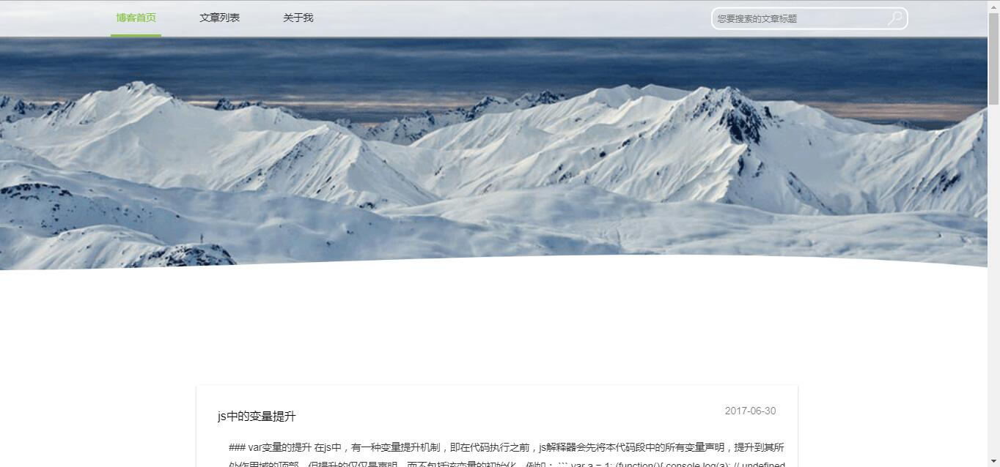
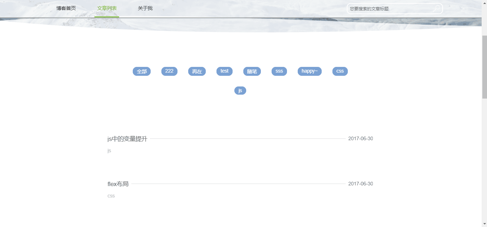
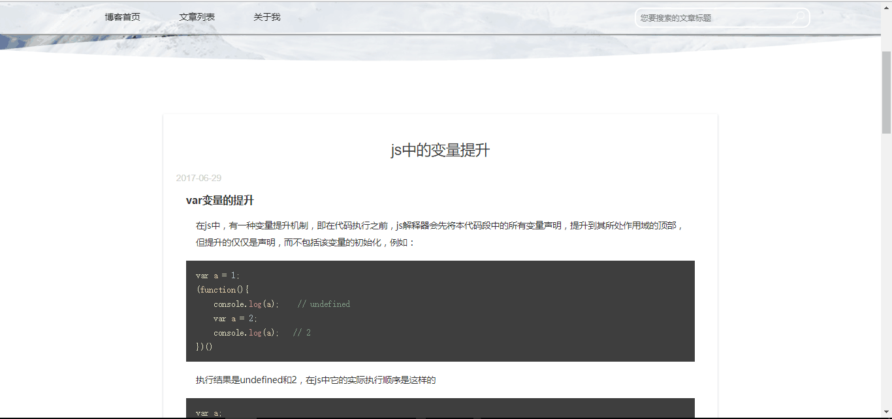
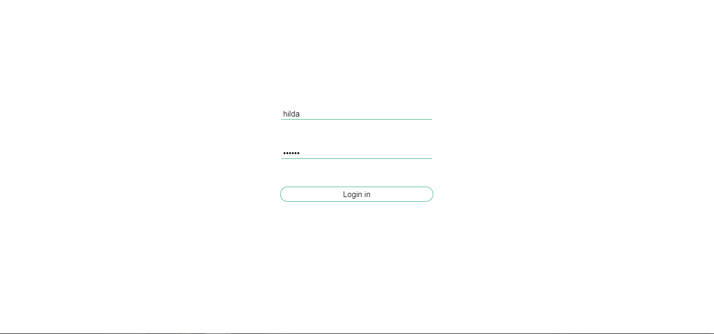
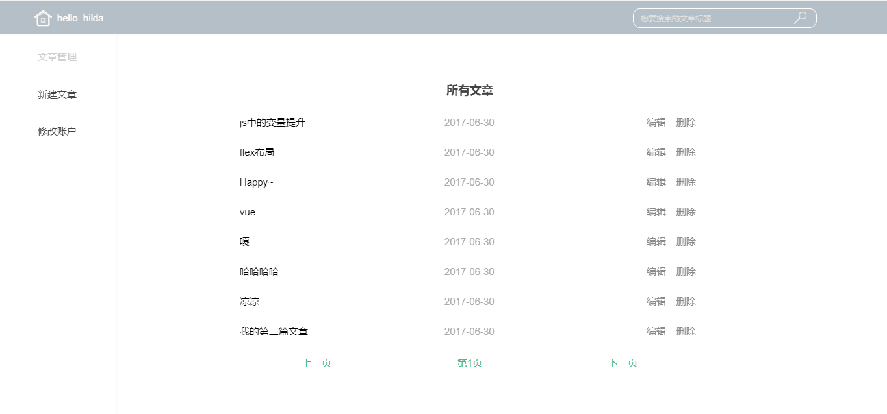
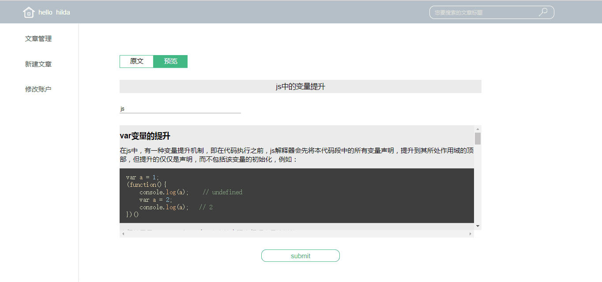

> A Vue.js project  
> Vue.js+Express+MongoDB搭建的前后端分离的博客系统

# 技术栈  
*  前端：Vue.js,vue.router,vuex,vue-resource  
*  后端：Mongodb,Express,node.js  

# 博客功能  
## 前台展示
- [x] 动态显示文章
- [x] 分类显示文章
- [x] 搜索文章
- [x] markdown和代码高亮渲染
- [ ] 评论模块
- [ ] 邮件功能
## 后台管理
- [x] 发布文章
- [x] 修改文章
- [x] 删除文章
- [x] 搜索文章
- [x] 登录验证
- [x] 修改账户
- [ ] 草稿
# 运行
## 环境
* mongodb
* node.js
## 克隆项目
```
git clone https://github.com/Hilda1227/Blog-CMS.git
```
## 安装依赖
```
npm install
```
## 启动服务器
开启数据库以后
```
npm run start
```
不要关闭这个窗口，然后Win+R再开启另一个窗口
## 加载项目
```
npm run dev
```
稍等一会儿，页面就会自动在浏览器窗口加载了
# 示例页面
### 首页
  

### 文章列表
  

### 文章详细
  

### 登陆
  

### 后台管理
  

### 文章发布


### 效果演示
<video>
      <source id="mp4" src="./src/assets/img/admin.mp4" type="video/mp4">
 </video>